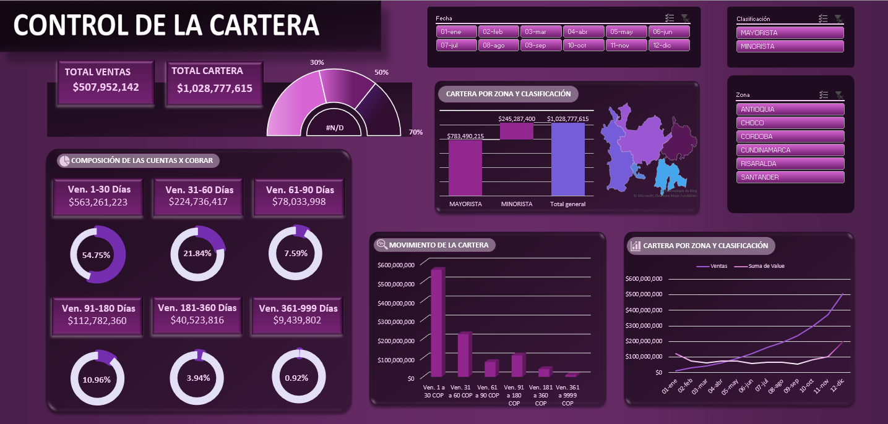
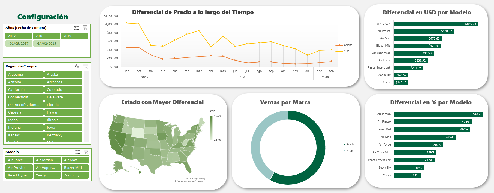

# 📊 Data Analytics Portfolio

This repository contains data analysis projects developed as part of my academic training in Information Technology Engineering. The projects focus on business insights, KPI tracking, and data visualization.

---

## 💰 1. Accounts Receivable Analysis (Excel - Academic Project)

Dashboard focused on analyzing accounts receivable and financial performance across customers, regions, and classifications.

### 📌 Key Insights:
- Total sales and total accounts receivable KPIs
- Composition of accounts receivable
- Movement of receivables over time
- Regional and customer classification analysis
- Dynamic filtering by date, region, and classification

### 📊 Dashboard Preview

This dashboard helps analyze financial behavior, customer segmentation, and receivable performance over time.
---

## 👟 2. StockX Sneaker Sales Analysis (Excel - Academic Project)

Sales analysis dashboard based on StockX sneaker market data, focused on pricing behavior and brand performance.

### 📌 Key Insights:
- Price differential trends over time
- Price variation by sneaker model (USD and %)
- Brand comparison (Nike vs Adidas)
- Geographic analysis of highest price differentials
- Dynamic filters by date, region, and model

### 📊 Dashboard Preview

This dashboard provides insights into sneaker market trends, pricing differences, and brand performance.
---

## 🛠️ Tools & Skills
- Microsoft Excel
- Pivot Tables
- KPI Dashboards
- Data Visualization
- Basic Data Analysis

---

## 🚀 Upcoming Projects
- Power BI dashboards (business intelligence)
- SQL data analysis (MySQL queries, joins, aggregations)
- Python data analysis (Pandas, Matplotlib)

---

## 📌 Note
This portfolio is continuously growing as I develop my skills in data analysis and business intelligence.
