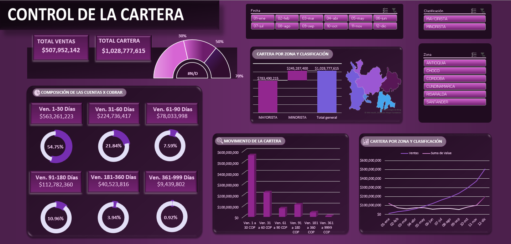
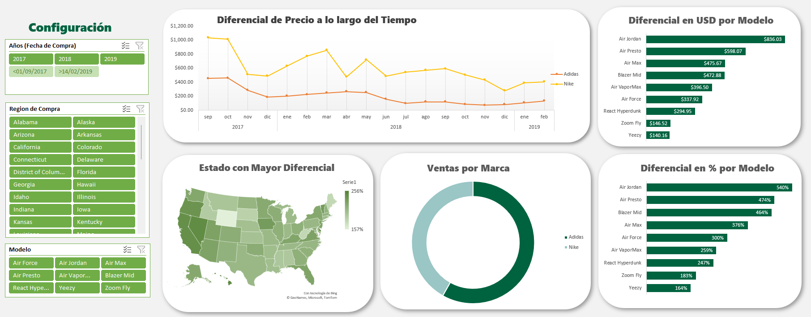
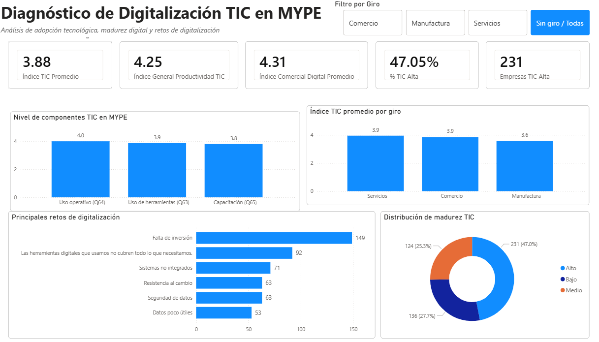
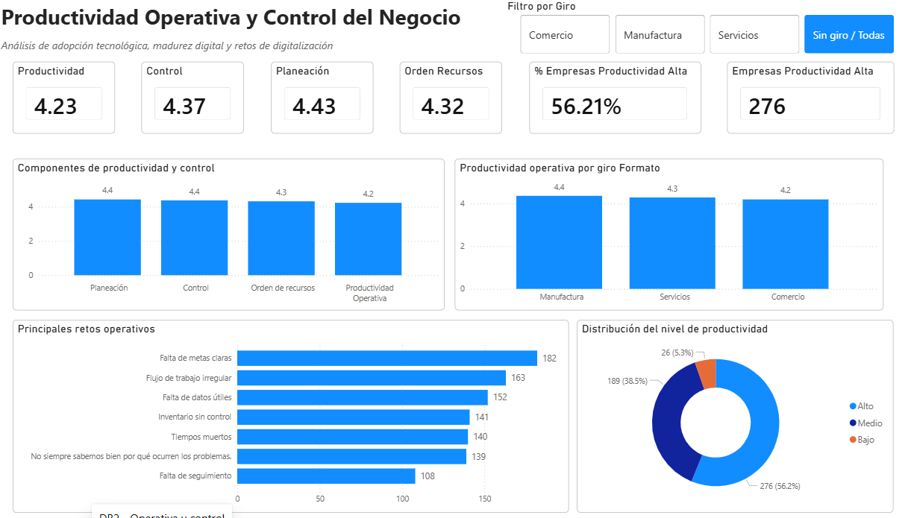
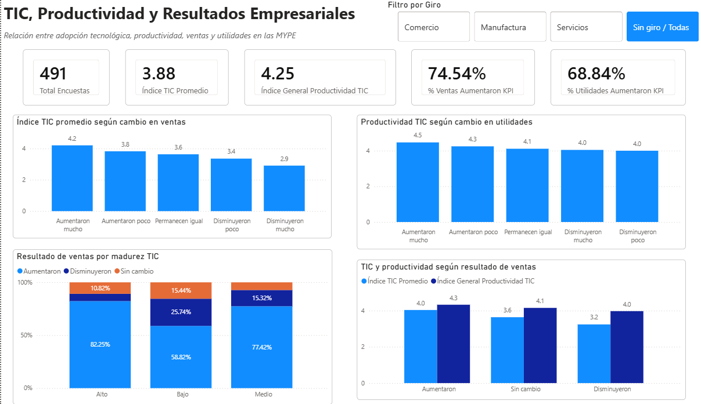
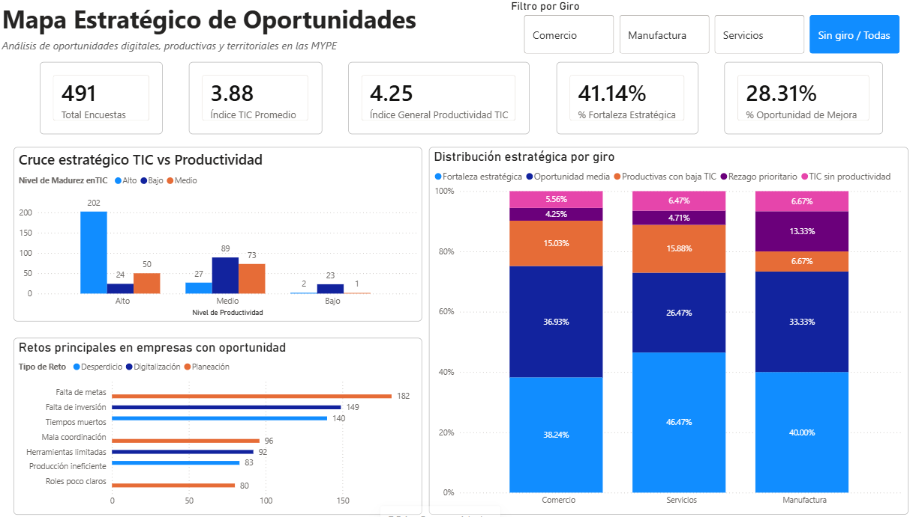

# 📊 Data Analytics Portfolio

This repository contains data analysis projects developed as part of my academic training in Information Technology Engineering. The projects focus on business insights, KPI tracking, data cleaning, business intelligence, and data visualization.

---

## 💰 1. Accounts Receivable Analysis (Excel - Academic Project)

Dashboard focused on analyzing accounts receivable and financial performance across customers, regions, and classifications.

### 📌 Project File

[Download Excel File](Dashboard%20para%20las%20cuentas%20por%20cobrar.xlsx)

### 📌 Key Insights:
- Total sales and total accounts receivable KPIs
- Composition of accounts receivable
- Movement of receivables over time
- Regional and customer classification analysis
- Dynamic filtering by date, region, and classification

### 🛠️ Tools Used:
- Microsoft Excel
- Pivot Tables
- KPI Dashboard
- Data Visualization

### 📊 Dashboard Preview

This dashboard helps analyze financial behavior, customer segmentation, and receivable performance over time.

---

## 👟 2. Collector Sneakers Sales Analysis (Excel - Academic Project)

Sales analysis dashboard based on collector sneaker market data, focused on pricing behavior, sales performance, and brand comparison.

### 📌 Project File

[Download Excel File](Ventas%20de%20Tenis%20de%20Coleccionista.xlsx)

### 📌 Key Insights:
- Price differential trends over time
- Price variation by sneaker model in USD and percentage
- Brand comparison between Nike and Adidas
- Geographic analysis of highest price differentials
- Dynamic filters by date, region, and model

### 🛠️ Tools Used:
- Microsoft Excel
- Pivot Tables
- KPI Dashboard
- Data Visualization

### 📊 Dashboard Preview

This dashboard provides insights into collector sneaker market trends, pricing differences, and brand performance.

---

## 📈 3. MYPE Productivity and ICT Analysis (Power BI - Academic Project)

Business intelligence project focused on analyzing productivity, ICT adoption, operational performance, commercial digitalization, and strategic improvement opportunities in micro and small enterprises (MYPEs).

The project was developed using survey data from RELAYN 2026. The dataset was cleaned and transformed in Power Query, removing sensitive personal information and keeping only relevant analytical variables. Several calculated indexes were created to summarize Likert-scale questions into measurable business indicators.

### 📌 Project Objective:

To analyze how ICT adoption, productivity practices, operational control, resource management, and business results are related within MYPEs using interactive Power BI dashboards.

### 📂 Power BI File:

[Download Power BI Project File](MYPES.pbix)

### 🧹 Data Preparation:

- Cleaned and filtered valid survey responses
- Removed personal and sensitive business information
- Converted Likert-scale answers into numerical values
- Created analytical variables such as business sector, company size, worker ranges, ICT maturity level, and productivity level
- Created business indexes for ICT, planning, control, operational productivity, resource management, commercial digitalization, and general productivity-ICT performance
- Built auxiliary tables for filtering and dashboard interaction
- Created calculated measures using DAX for KPIs, percentages, averages, and strategic classifications

### 📊 Dashboards Developed:

#### 1. ICT Digitalization Diagnosis

Dashboard focused on analyzing the level of digital adoption among MYPEs.

**Main analysis:**
- ICT adoption index
- ICT maturity level distribution
- ICT components analysis
- Digitalization challenges
- ICT comparison by business sector

**Key indicators:**
- Average ICT index
- Companies with high ICT maturity
- Percentage of companies with high ICT maturity
- Commercial digital index
- General productivity and ICT index

#### 2. Operational Productivity and Business Control

Dashboard focused on analyzing internal productivity, planning, control, and resource management.

**Main analysis:**
- Operational productivity index
- Planning index
- Control index
- Resource management index
- Productivity level distribution
- Main operational challenges

**Key indicators:**
- Average operational productivity
- Average planning score
- Average control score
- Average resource management score
- Companies with high productivity
- Percentage of companies with high productivity

#### 3. ICT, Productivity, and Business Results

Dashboard focused on comparing ICT and productivity indicators with business results such as sales and profits.

**Main analysis:**
- Relationship between ICT adoption and sales behavior
- Productivity and ICT analysis by profit changes
- Sales results by ICT maturity level
- Comparison of ICT and productivity by business result groups

**Key indicators:**
- Total valid surveys
- Average ICT index
- General productivity and ICT index
- Percentage of companies with increased sales
- Percentage of companies with increased profits

#### 4. Strategic Opportunities Map

Dashboard focused on identifying strategic improvement opportunities based on ICT maturity and productivity levels.

**Main analysis:**
- Strategic classification based on ICT maturity and productivity level
- Identification of companies with improvement opportunities
- Strategic distribution by business sector
- Main challenges among companies with low ICT or low productivity performance

**Key indicators:**
- Percentage of companies in strategic strength
- Percentage of companies with improvement opportunities
- Average ICT index
- General productivity and ICT index
- Total companies analyzed

### 📌 Key Insights:

- The average ICT index was **3.88 / 5**, showing a medium-high level of digital adoption.
- The general productivity and ICT index reached **4.25 / 5**, indicating strong productivity-related practices.
- **47.05%** of companies showed high ICT maturity.
- **56.21%** of companies showed high productivity levels.
- **74.54%** of companies reported increased sales.
- **68.84%** of companies reported increased profits.
- A significant group of companies showed both high productivity and high ICT maturity, representing strategic strengths.
- The main improvement areas were related to investment limitations, unclear goals, workflow issues, lack of follow-up, poor coordination, and limited digital tools.

### 🛠️ Tools Used:

- Power BI
- Power Query
- DAX
- Data Modeling
- KPI Design
- Business Intelligence Dashboards
- Data Cleaning
- Data Visualization

### 📊 Dashboard Preview

#### ICT Digitalization Diagnosis

#### Operational Productivity and Business Control

#### ICT, Productivity, and Business Results

#### Strategic Opportunities Map

This project helped transform survey data into actionable business insights, allowing the identification of productivity strengths, digital maturity levels, operational weaknesses, and strategic improvement opportunities for MYPEs.

---

## 🛠️ Tools & Skills

- Microsoft Excel
- Power BI
- Power Query
- DAX
- Pivot Tables
- KPI Dashboards
- Data Cleaning
- Data Modeling
- Business Intelligence
- Data Visualization
- Basic Data Analysis
- Business Insights

---

## 🚀 Upcoming Projects

- SQL data analysis using MySQL queries, joins, and aggregations
- Python data analysis using Pandas and Matplotlib

---

## 📌 Note

This portfolio is continuously growing as I develop my skills in data analysis, business intelligence, and data visualization.
